**Phan Thị Hồng Huế - Tuần 2**


## Phần 1: Giới thiệu tổng quan về Linux

1. **Linux là gì?**

   - Khái niệm: Linux là một hệ điều hành (OS) mã nguồn mở, do Linus Torvalds tạo ra vào năm 1991 và được cộng đồng phát triển thành một trong những OS phổ biến nhất hiện nay.

   - Phân biệt giữa Linux kernel và các bản phân phối (Ubuntu, CentOS, Debian...).
   
     - Linux distro – hay bản phân phối Linux là giLinux distro là các hệ điều hành được phát triển dựa trên nhân Linux. Nó có vai trò đóng gói nhân Linux cùng với các phần mềm và tiện ích cần thiết, tạo thành một hệ điều hành hoàn chỉnh mà mà người dùng có thể cài đặt và khởi chạy. 

| Tên | Khái niệm | Ưu điểm | Nhược điểm |
|---------------|-------------|----------|------------|
Linux kernel|Lõi của hệ điều hành Linux, quản lý phần cứng, bộ nhớ, tiến trình và hệ thống tập tin.|Nhẹ, hiệu suất cao, ổn định, có thể tùy chỉnh.| Không có giao diện người dùng, cần các bản phân phối để sử dụng đầy đủ.
Ubuntu |Bản phân phối phổ biến, thân thiện với người mới, dựa trên Debian | Giao diện thân thiện, dễ sử dụng, hỗ trợ phần cứng tốt, cộng đồng lớn. | Tích hợp nhiều gói phần mềm mặc định khiến hệ thống trở nên nặng nề với cấu hình thấp.
CentOS |Bản phân phối ổn định, miễn phí, gần giống Red Hat.Ổn định, thích hợp cho server, chu kỳ nâng cấp dài.|Ổn định, thích hợp cho server, chu kỳ nâng cấp dài.|Một số phiên bản đã EOL, hỗ trợ phần mềm mới hạn chế.

=> **Kết luận**: 
- Linux Kernel: Lõi của hệ điều hành, quản lý phần cứng và tài nguyên.
- Bản phân phối (Distro): Ubuntu, CentOS, Debian… cung cấp giao diện, trình quản lý gói, phần mềm sẵn có.

2. **Tại sao nên học Linux**

   - **Ứng dụng rộng rãi trong server, cloud, DevOps, AI, lập trình hệ thống**.
     - Server: 
       - Ổn định, hiệu suất cao, khả năng xử lý đa luồng và khối lượng công việc lớn.
       - Hỗ trợ: Web server, Database server, Email server, Cloud server
       - VD: Ubuntu server
      - Cloud: 
        - Xây dựng và quản lý cơ sở hạ tầng đám mây, chạy VM, container, microservices.
        - Tính năng: khả năng mở rộng (scalability), linh hoạt (flexibility), xử lý đồng thời nhiều tiến trình/luồng.
        - VD: Amazon Web Services (AWS), Google Cloud Platform (GCP), Microsoft Azure.
    
     - DevOps
       - Tự động hóa triển khai, quản lý server, CI/CD, container orchestration.
       - Công cụ: Docker, Kubernetes, Jenkins, Ansible, GitLab CI.
       - VD: Triển khai ứng dụng web tự động, quản lý hạ tầng bằng Infrastructure as Code (IaC)
     - AI/Machine Learning
       - Chạy các framework AI/ML, xử lý dữ liệu lớn, tận dụng GPU/CPU đa luồng.
       - Công cụ: TensorFlow, PyTorch, Hadoop, Spark.
       - VD: Mô hình học sâu (Deep Learning) trên server Linux với GPU.

   - **Sự khác biệt giữa Linux và Windows/macOS**.
   

    | **Tiêu chí** | **Linux** | **Windows** | **macOS** |
    |---------------|------------|--------------|------------|
    | **Tính chất mã nguồn** | Mã nguồn mở, người dùng có quyền truy cập, thay đổi và phân phối lại mã nguồn. | Mã nguồn đóng, phát triển độc quyền bởi Microsoft. | Mã nguồn đóng, phát triển độc quyền bởi Apple, dựa trên nền Unix. |
    | **Bảo mật** | Bảo mật cao nhờ cơ chế phân quyền và cập nhật nhanh; ít bị tấn công hơn do thị phần nhỏ. | Thường là mục tiêu của phần mềm độc hại do thị phần lớn hơn. | Bảo mật tốt, được Apple kiểm soát chặt chẽ cả phần mềm và phần cứng. |
    | **Quản lý tài nguyên** | Hoạt động tốt trên phần cứng yếu, sử dụng ít tài nguyên hệ thống. | Tiêu thụ nhiều tài nguyên, đặc biệt trên hệ thống cấu hình thấp. | Tối ưu tốt trên phần cứng Apple, hiệu suất ổn định nhưng khó cài trên máy khác (hackintosh). |
    | **Cập nhật hệ thống** | Rolling-release hoặc fixed-release, không yêu cầu khởi động lại khi cập nhật. | Cập nhật bắt buộc, thường yêu cầu khởi động lại, đôi khi gây gián đoạn công việc. | Cập nhật định kỳ, ổn định, thường yêu cầu khởi động lại nhưng ít gây lỗi. |
    | **Cộng đồng hỗ trợ** | Cộng đồng mã nguồn mở lớn, hỗ trợ từ diễn đàn, wiki, GitHub. | Hỗ trợ chính thức từ Microsoft và cộng đồng người dùng rộng. | Hỗ trợ chính thức từ Apple, cộng đồng nhỏ hơn, ít tự do phát triển. |
    | **Khả năng tùy chỉnh** | Tùy chỉnh cao, có thể thay đổi từ kernel đến giao diện người dùng. | Giới hạn tùy chỉnh, chủ yếu thông qua các thiết lập sẵn. | Hạn chế tùy chỉnh, ưu tiên trải nghiệm người dùng đồng nhất và ổn định. |
    | **Ứng dụng và phần mềm** | Nhiều phần mềm mã nguồn mở; cần Wine hoặc máy ảo để chạy ứng dụng Windows. | Nhiều phần mềm thương mại, phổ biến trong doanh nghiệp. | Hỗ trợ tốt cho thiết kế đồ họa, âm nhạc, lập trình iOS; ít phần mềm game. |
    | **Phù hợp cho máy chủ** | Phổ biến cho máy chủ web và doanh nghiệp nhờ tính ổn định, bảo mật cao. | Windows Server được dùng trong doanh nghiệp lớn, tích hợp tốt với hệ sinh thái Microsoft. | Ít được dùng cho máy chủ, chủ yếu trong môi trường phát triển macOS/iOS. |
    | **Giá thành** | Miễn phí, hầu hết các bản phân phối không có phí bản quyền. | Phải trả phí bản quyền cho hệ điều hành và phần mềm như Office. | Tính trong giá phần cứng Apple, không bán riêng hệ điều hành. |
    | **Bảo trì hệ thống** | Bảo trì đơn giản, cập nhật linh hoạt, không cần khởi động lại thường xuyên. | Bảo trì phức tạp hơn, cập nhật tự động đôi khi gây lỗi. | Bảo trì dễ dàng, Apple kiểm soát toàn bộ quy trình cập nhật. |
    | **Thị phần và độ phổ biến** | Phổ biến trong server, hệ thống nhúng, môi trường lập trình. | Chiếm thị phần lớn nhất trong máy tính cá nhân. | Phổ biến trong lĩnh vực sáng tạo (thiết kế, âm nhạc, media). |

   
   - **Ưu điểm: bảo mật, miễn phí, tùy biến, hiệu suất cao.**
     + **Mã nguồn mở và miễn phí**: Phần mềm mã nguồn mở cho phép bất kỳ ai cũng có thể đóng góp, chỉnh sửa và cải thiện mã nguồn. Ngoài ra, người dùng có thể tải xuống và sử dụng miễn phí.
     + **Khả năng tùy chỉnh và linh hoạt**: Người dùng có thể linh hoạt trong việc chỉnh sửa hệ điều hành theo nhu cầu của mình. Linux có nhiều bản phân phối, bao gồm Fedora, Ubuntu, Arch Linux, Debian, Linux Mint và các bản phân phối khác. Các bản phân phối này cung cấp cho người dùng nhiều tùy chọn tính năng hơn.
     + **Bảo mật cao**: Quản trị viên phải nhập mật khẩu để cấp quyền cho từng chương trình trong ứng dụng. Linux giảm thiểu khả năng phần mềm độc hại được thực thi theo cách này.
     + **Độ ổn định và tin cậy**: Linux có thể xử lý công việc với khối lượng lớn mà không ảnh hướng đến hiệu suất và được thiết kế để chạy trong thời gian dài mà không cần khởi động lại.
     + **Hỗ trợ cho máy cấu hình yếu**: Linux vẫn hỗ trợ cập nhật, nâng cấp thường xuyên với các máy có cấu hình yếu trong khi sử dụng.
     + **Hiệu suất cao**: Linux quản lý tài nguyên hệ thống hiệu quả, tiêu tốn ít bộ nhớ và CPU hơn so với nhiều hệ điều hành khác, phù hợp với server, máy chủ, và các môi trường cần chạy liên tục với tải nặng.

3. **Kiến trúc hệ thống Linux**
   - Cấu trúc: 3 thành phần chính:
      + **Kernel (Nhân)**: Là phần quan trọng nhất trong Linux, có nhiệm vụ quản lý các tài nguyên của phần cứng như bộ nhớ, module, bộ vi xử lý… và giúp phần cứng có thể giao tiếp với các ứng dụng trên hệ điều hành.
      + **Shell**: Là nơi chứa và thực thi các dòng lệnh được yêu cầu đến cho Kernel xử lý từ người dùng hoặc ứng dụng. Đây được xem là cầu nối giữa Application và Kernel.
      + **Application**: Là các ứng dụng hoặc tiện ích được người dùng cài đặt và chạy trên server để phục vụ nhu cầu sử dụng (Ví dụ: Proxy, Samba và FTP…).

    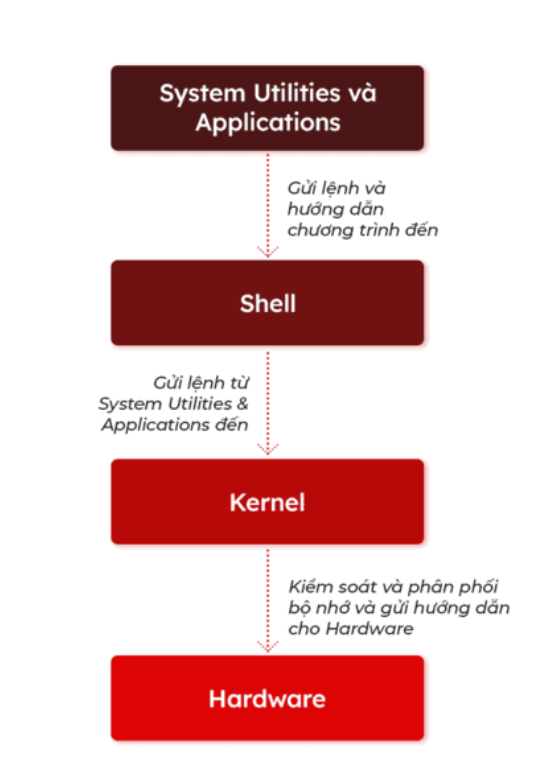
    
   - **Quá trình khởi động (boot process) cơ bản**.
     - **BIOS / UEFI**
       - POST (Power-On Self-Test): Khi bật nguồn, BIOS (Basic Input/Output System) hoặc UEFI (Unified Extensible Firmware Interface) chạy kiểm tra các thành phần phần cứng cơ bản (CPU, RAM, card màn hình).
       - Tìm thiết bị Boot: Firmware (BIOS/UEFI) xác định thiết bị (ổ đĩa) để khởi động theo thứ tự cấu hình.
       - Tải Bootloader: Firmware đọc Master Boot Record (MBR) (với BIOS) hoặc EFI System Partition (ESP) (với UEFI) trên thiết bị đó và tải Bootloader (ví dụ: GRUB, LILO) vào bộ nhớ.
  
     - **Bootloader** (Trình nạp khởi động): là chương trình nhỏ giúp nạp kernel của Linux vào RAM.
       -Hiển thị Menu: Bootloader (thường là GRUB) hiển thị một menu cho phép người dùng chọn hệ điều hành hoặc kernel muốn khởi động.
       - Tải Kernel: Sau khi chọn (hoặc hết thời gian chờ), Bootloader tải hai thành phần chính vào RAM:
         - Kernel: Lõi của hệ điều hành.
         - Initramfs/Initrd: Một filesystem RAM tạm thời chứa các driver và tiện ích cơ bản cần thiết để kernel có thể truy cập ổ đĩa thực.
      - **Khởi tạo Kernel**:
        - Giải nén và Khởi tạo: Kernel tự giải nén và bắt đầu chạy.
        - Mount Root Filesystem tạm thời: Kernel sử dụng Initramfs/Initrd để load các module (driver) cần thiết để truy cập và mount Root Filesystem (hệ thống tập tin gốc) thực.
        - Chuyển giao: Kernel sau đó chuyển quyền điều khiển từ Initramfs sang hệ thống Init thực trên Root Filesystem.
      - **Hệ thống Init (systemd/SysVinit)**:
        - Khởi chạy Init: Kernel khởi chạy chương trình Init (hoặc systemd) – luôn là tiến trình có PID 1.
        - Thiết lập Môi trường: Init/systemd đọc các file cấu hình của nó để xác định các dịch vụ cần chạy.
        - Chạy Service/Target
          - SysVinit: Chạy các script trong các thư mục Runlevel (/etc/rc.d/rcX.d).
          - systemd (Phổ biến nhất): Khởi động các "Target" (nhóm các dịch vụ) theo thứ tự được định nghĩa (ví dụ: multi-user.target cho chế độ dòng lệnh, graphical.target cho chế độ đồ họa).
        - Hoàn thành: Sau khi tất cả các dịch vụ cần thiết đã khởi động, hệ thống hiển thị màn hình đăng nhập (CLI hoặc GUI), và quá trình khởi động kết thúc.
    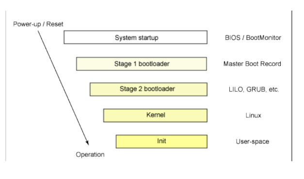
   
   - **Các thư mục hệ thống chính (`/bin`, `/etc`, `/home`, `/usr`, `/var`...).**
     - `root`: Thư mục cá nhân (home directory) của người dùng root (quản trị viên hệ thống). Nó được tách biệt khỏi /home để đảm bảo quyền truy cập và bảo mật. Ví dụ: `/root/.ssh`
     - `/bin`: Chứa các chương trình thực thi. Các chương trình chung của Linux được sử dụng bởi tất cả người dùng được lưu ở đây. Ví dụ như: `ps, ls, ping...`
     - `/etc`:Chứa các file cấu hình của các chương trình, đồng thời nó còn chứa các shell script dùng để khởi động hoặc tắt các chương trình khác. Ví dụ: `/etc/resolv.conf, /etc/logrolate.conf`
     - `home`: Chứa tất cả các file cá nhân của từng người dùng. Ví dụ: `/home/john, /home/marie`
     - `/usr`: Chứa các thư viện, file thực thi, tài liệu hướng dẫn và mã nguồn cho chương trình chạy ở level 2 của hệ thống.
     - `/var`: Thông tin về các biến của hệ thống được lưu trong thư mục này. Như thông tin về log file: `/var/log`, các gói và cơ sở dữ liệu `/var/lib..`
     - `/dev`: Các file thiết bị, không phải là các file dữ liệu thông thường mà là giao diện để truy cập các thiết bị phần cứng (ví dụ: ổ đĩa cứng, thiết bị đầu cuối). Ví dụ: `/dev/sda (ổ đĩa cứng đầu tiên), /dev/null (thiết bị ảo), /dev/tty`
     - `/lib`: Chứa các thư viện (shared libraries) thiết yếu cho các chương trình nhị phân trong `/bin` và `/sbin.`
     - `/tmp `: Chứa các file tạm thời (temporary files) được tạo ra bởi các chương trình và người dùng. Nội dung của thư mục này thường bị xóa khi hệ thống khởi động lại.
     - `/proc `: Chứa các file hệ thống ảo (virtual filesystem), cung cấp thông tin về tiến trình (processes) và kernel (nhân) của hệ thống đang chạy. Các file này được tạo ra trong bộ nhớ.
     - `/media`: Chứa các thiết bị như CdRom /media/cdrom. floppy /media/floopy hay các phân vùng đĩa cứng /media/Data 
   
   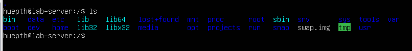

---

## Phần 2: Làm quen với Terminal và Shell

4. **Terminal & Shell là gì**

   - Terminal: giao diện dòng lệnh (CLI), cung cấp một cửa sổ để bạn nhập và xem kết quả của các lệnh. Terminal không trực tiếp hiểu lệnh, mà chỉ chuyển lệnh đến Shell để xử lý.
   - Shell: là chương trình xử lý lệnh – nhận lệnh từ Terminal, thông dịch rồi gửi yêu cầu cho Kernel (nhân hệ điều hành) để thực thi. Sau khi Kernel xử lý xong, Shell nhận kết quả và gửi trả lại Terminal.
   - Mở terminal, chạy lệnh cơ bản.
   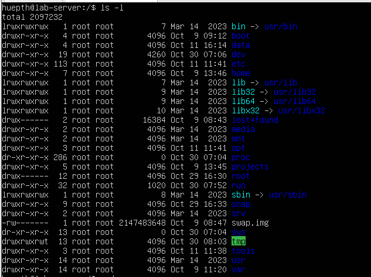

5. **Lệnh cơ bản trong Linux**

   - `pwd`, `ls`, `cd`, `clear`, `history`.
     - `pwd`: in ra 
     - `ls`: liệt kê nội dung các thư mục
       - `ls -l /` : hiển thị nội dung dạng danh sách
       - `ls -a /` hiển thị các file thư mục ẩn
       - `ls -t /` sắp xếp lại theo thứ tự mới nhất đến cũ nhất
       - ls -lta: gọp 3 câu lệnh trên
    
       

     - `cd`: di chuyển giữa các thư mục
     - `clear`: xóa sạch màn hình terminal
     - `history`: hiển thị lịch sử các lệnh dã dùng
     
     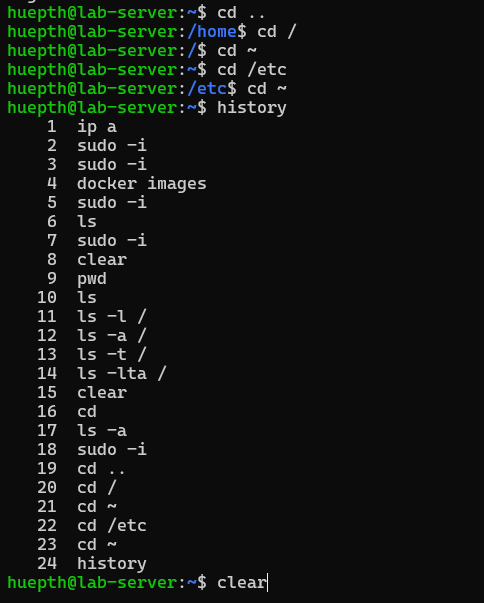
   - Sử dụng phím tắt: `Tab`, `Ctrl + C`, `Ctrl + D`.
     - `Tab`: tự động hoàn thành tên lệnh, tên file, thư mục..
     - `Ctrl + C`: hủy tiến trình đang chạy
     - `Ctrl + D`: đóng terminal hoặc thoát cell

6. **Hiểu cấu trúc đường dẫn**
   - Đường dẫn tuyệt đối vs tương đối.
     - Đường dẫn tuyệt đối: là đường dẫn đầy đủ bắt dầu từ thu mục gốc, không phụ thuộc vào vị trí hiện tại.
     - Đường dẫn tương đối: là đường dẫn tính từ thư mục hiên tại, không bắt đầu bằng `/`
   - Dấu `~`, `.`, `..` ý nghĩa và cách dùng.
     - `~`: thư mục **home** của người dùng hiện tại
     - `.`: thư mục hiện tại
     - `..`: thư mục cha
---

## Phần 3: Làm việc với file và thư mục

7. **Tạo, xem, xóa và di chuyển file**

   - `touch`, `cat`, `less`, `head`, `tail`.
     - `touch `: tạo 1 file mới 
     -  `cat`: hiển thị nội dung file ra ngoài màn hình
     -  `less`: xem nội dung dài
     -  `head`: hiện thị những dòng đầu của file
     -  `tail`: hiển thị những dòng cuối của file
    
       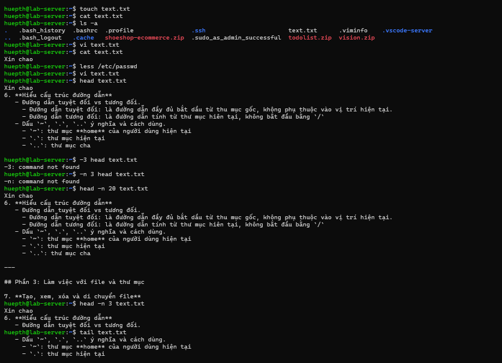

   - `cp`, `mv`, `rm`, `mkdir`, `rmdir`.
     - `cp`: sao chép file/ thư mục
     - `mv`: di chuyển file/thư mục
     - `rm`: xóa file hoặc thư mục
     - `mkdir`: tạo thư mục mới
     - `rmdir`: xóa thư mục trống

    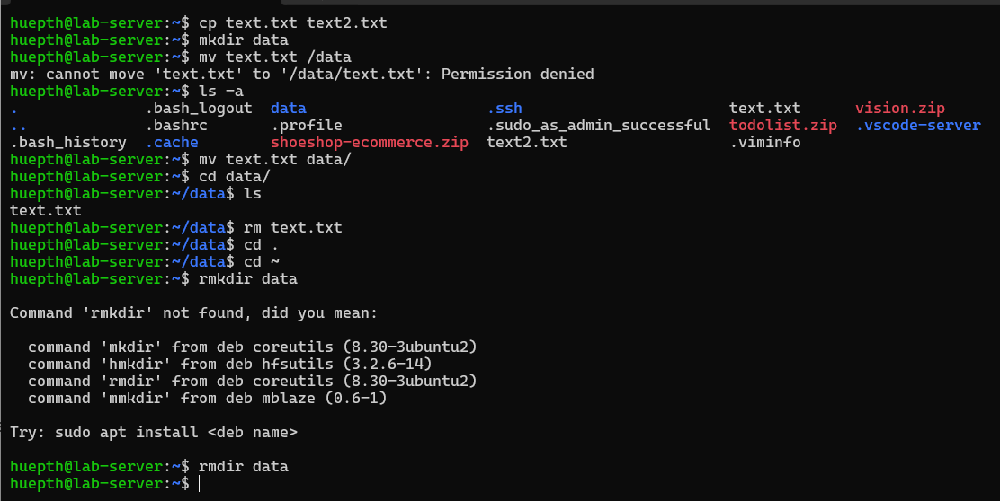

8. **Sao chép và nén file**

   - `tar`, `gzip`, `zip`, `unzip`, `scp`.
     - `tar`: Đóng gói và giải nén nhiều file/thư mục:
       - `c`: create - tạo file nén `.tar`
       - `x`: extract - giải nén
       - `v`: verbose: hiển thị chi tiết quá trình
       - `f`: file - chỉ định tên file nén.
       - `-z`: nén bằng `gzip`
       
    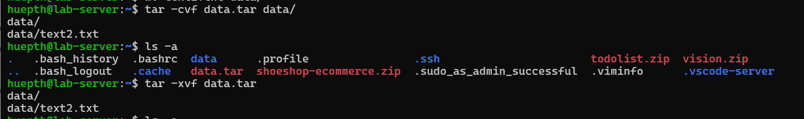

     - `gzip`: Nén và giải nén file đơn lẻ
     - `zip`: nén theo định dạng `zip`
     - `unzip`: giải nén theo định dạng `zip`
     - `scp`: Sao chép file giữa các máy qua SSH
    
    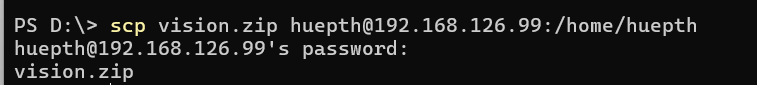
     
   -  Giải thích khái niệm stream (`stdin`, `stdout`, `stderr`).
        - `stdin`: Standard Input - Dữ liệu nhập (thường là bàn phím)
        - `stdout`: Standard Output - Dữ liệu xuất ra (thường là màn hình)
        - `stderr`: Standard Error - Dòng lỗi của chương trình

9. **Tìm kiếm file**
   - `find`, `locate`, `grep`.
     - `find`: Tìm file trong hệ thống
     - `locate`:tìm nhanh
     - `grep`: tìm chuỗi trong file
   - Kết hợp `grep` với `pipe (|)`.

---

## Phần 4: Quyền truy cập và người dùng

10. **Người dùng và nhóm (User & Group)**

    - `whoami`, `id`, `adduser`, `deluser`.
      - `whoami`: kiểm tra xem đang đăng nhập với user nào
      - `id`: hiển thị UID (User ID), GID (Group ID) và các nhóm (groups) mà người dùng thuộc về.
      - `adduser`:tạo user mới và tạo ra các thông tin thư mục liên quan tới user đó
      - `deluser`: xóa user
      
      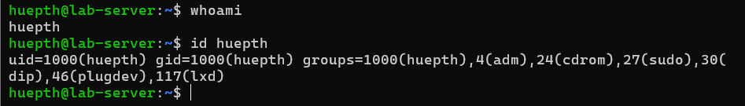
    
    - `su`, `sudo`, `/etc/passwd`.
      - `su` (switch user) cho phép bạn chuyển sang một người dùng khác trong cùng hệ thống.
      ```
          su [username]: chỉ chuyển user, giữ nguyên môi trường hiện tại.
          su - [username]: chuyển user và tải luôn môi trường, biến môi trường của user đó.
      ```
      - `sudo`: (superuser do) cho phép user thực thi lệnh với quyền root tạm thời và chỉ những user thuộc nhóm sudoers mới có quyền này. => giúp an toàn hơn thay vì đăng nhập trực tiếp root.
      - `/etc/passwd`: file chứa danh sách tất cả user của hệ thống.

11. **Phân quyền file**

    - `ls -l`, quyền đọc/ghi/thực thi (`rwx`).
      - `ls -l`: xem danh sách các file/ thư mục kèm quyền truy cập, chủ sở hữu, nhóm và các thông tin khác.
      - `rwx `: đọc/ ghi/ thực thi: `r = 4, w = 2, x = 1` => Người dùng full quyền: `rwx = 7`
    - `chmod`, `chown`, `chgrp`.
      - `chmod`: thay đổi quyền truy cập file/ thư mục
      - `chown`: thay đổi chủ sở hữu của file/ thư mục
      - `chgrp`: thay đổi nhóm sở hữu của file/ thư mục

    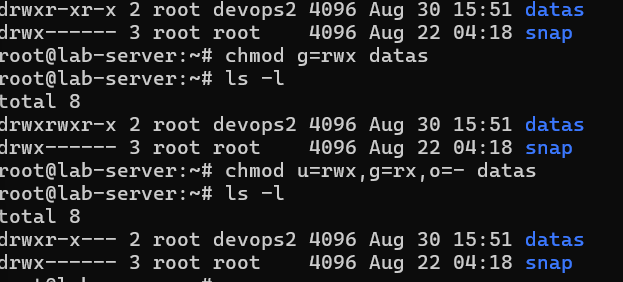
    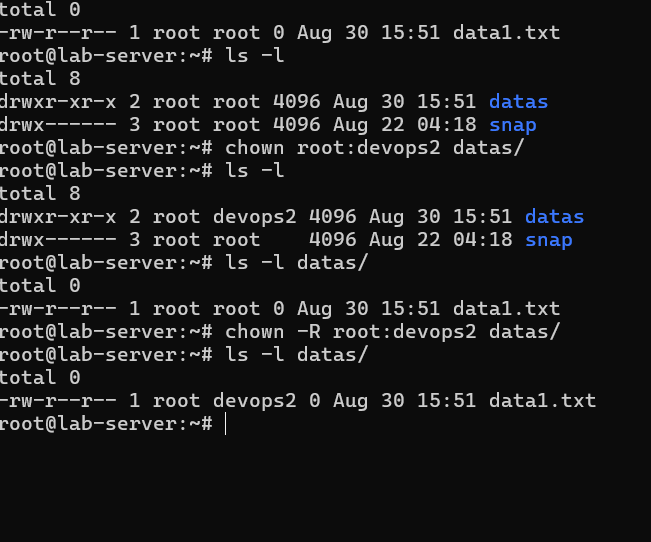


12. **Quyền root và an toàn**
    - Tại sao không nên chạy mọi thứ bằng root.
      - Tài khoản **root** (còn gọi là superuser) là tài khoản người dùng có đặc quyền cao nhất trên hệ thống. Nó được thiết kế để thực hiện các tác vụ quản trị hệ thống quan trọng
      - Không nên chạy mọi thứ bằng **root**:
        - **Rủi ro bảo mật cao**: Nếu chạy chương trình bằng quyền root, bất kỳ lỗ hổng hoặc mã độc nào trong chương trình đó cũng có thể kiểm soát toàn bộ hệ thống.
        - Vi phạm nguyên tắc **“nguyên tắc đặc quyền tối thiểu”** (Principle of Least Privilege) — chỉ cấp quyền cần thiết để hạn chế thiệt hại khi có sự cố.
        - **Lỗi người dùng có thể gây hại lớn**: Một thao tác sai (ví dụ: xóa nhầm file hệ thống, ghi đè cấu hình quan trọng) có thể khiến hệ thống bị hỏng hoàn toàn.
        - **Giảm khả năng kiểm soát và phân quyền**: Việc luôn dùng root khiến khó theo dõi ai đã thực hiện hành động nào, gây khó khăn cho quản lý và bảo mật.
    - Phân biệt `sudo` và `su`.
      - `Sudo` là một cơ chế quản lý quyền, phụ thuộc vào /etc/sudoers, để cho phép người dùng thực hiện một số lệnh quản trị với quyền root hoặc quyền của người dùng khác mà không cần đăng nhập trực tiếp vào tài khoản đó. Khi dùng sudo, người dùng nhập mật khẩu của chính mình.
      - `su`: (viết tắt của substitute user hoặc switch user) được dùng để chuyển đổi sang tài khoản khác (thường là root) bằng cách nhập mật khẩu của tài khoản đích. Nó mở một phiên shell mới với quyền của người dùng đó cho đến khi thoát ra (exit).

---

## Phần 5: Quản lý tiến trình và hệ thống

13. **Quản lý tiến trình (process)**

    - `ps`: liệt kê các dòng lệnh đang chạy.
    - `top`: theo dõi tiến trình đang chạy theo thời gian thực, sắp xếp theo mức sử dụng CPU. Cung cấp cái nhìn động về tải hệ thống.
    - `htop`: phiên bản cải tiến hơn của `top` hỗ trợ thao tác bằng chuột và hiển thị đồ họa dễ nhìn.
    -  `kill`: Gửi tín hiệu tới một tiến trình dựa trên PID (Process ID)
    -  `killall`. Gửi tín hiệu tới các tiến trình dựa trên tên tiến trình (process name).
    
    - **Foreground và background process (`&`, `fg`, `bg`).**
      - **Foreground**: Tiến trình chạy trực tiếp, chiếm quyền điều khiển terminal, phải chờ lệnh hoàn thành hoặc nhấn Ctrl+C để dừng.
      - **Background** : Tiến trình chạy ngầm, không chiếm quyền điều khiển terminal, cho phép tiếp tục thực hiện các lệnh khác.

14. **Kiểm tra tài nguyên hệ thống**

    - `df`, `du`, `free`, `uptime`, `uname`, `lscpu`, `lsblk`.
      - `df -h`: hiển thị dung lượng đĩa còn trống (`-h`: hiển thị dung lượng ở dạng dễ đọc (GB, MB).)
      - `free -m`:  hiển thị thông tin RAM
      - `du`: kiểm ra dung lượng thư mục hoặc file đang chiếm dụng `du -sh /home/huepth`
      - `uname`: xem thông tin hệ điều hành và nhân
      - `lscpu`:xem thông tin CPU chi tiết.
      - `lsblk`: hiển thị danh sách ổ đĩa và phân vùng
    
    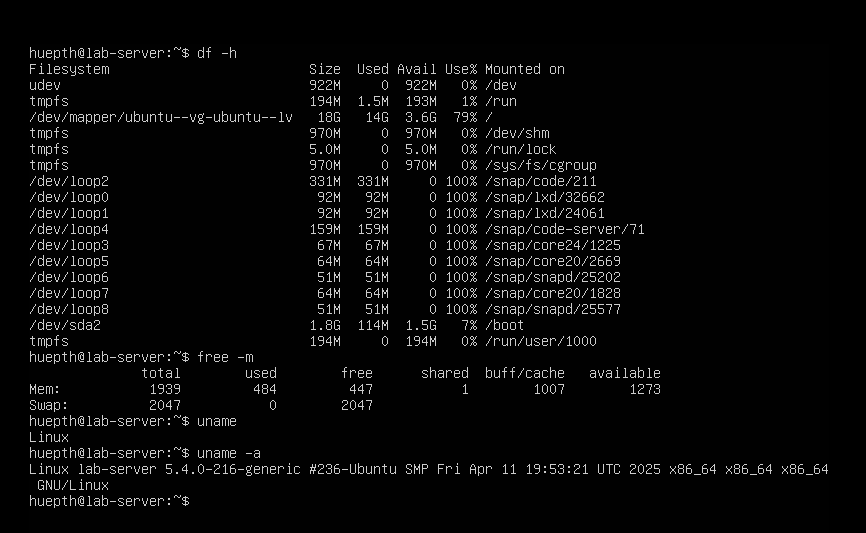
    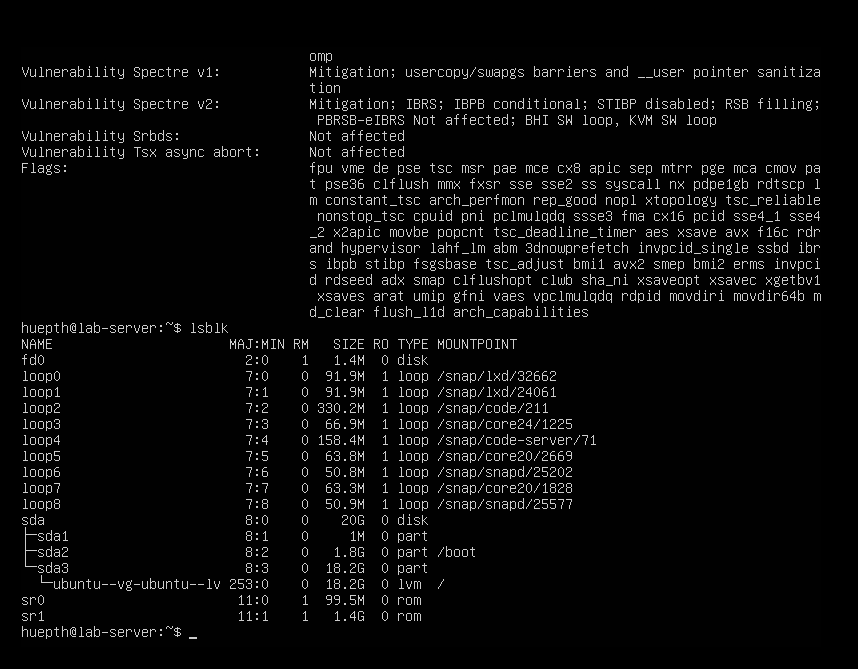

15. **Dịch vụ và tiến trình nền (daemon)**
    - `systemctl`: Quản lý dịch vụ trong hệ thống dùng systemd
    ```
    systemctl start <service> - Khởi động dịch vụ
    systemctl stop <service> - Dừng dịch vụ
    systemctl restart <service> - Khởi động lại dịch vụ
    systemctl status <service> - Kiểm tra trạng thái dịch vụ
    systemctl enable <service> - Tự động khởi động khi boot
    systemctl disable <service> - Ngừng tự động khởi động

    ```
    - `service`: Lệnh cũ, tương thích hệ thống dùng SysVinit
    
    ```
    service <service> start
    service <service> stop
    service <service> restart
    service <service> status
    ```
    - `journalctl`: Dùng để xem log của systemd và các dịch vụ (daemon).
    
    ```
    journalctl - Xem toàn bộ log hệ thống
    journalctl -u nginx - Xem log của dịch vụ nginx
    journalctl -u ssh --since today - Xem log ssh từ hôm nay
    journalctl -xe  - Xem log lỗi chi tiết nhất

    ```
    - Start/stop/restart dịch vụ.
      - Start – Khởi động dịch vụ
      - Stop – Dừng dịch vụ đang chạy.
      - Restart – Khởi động lại dịch vụ dùng khi thay đổi cấu hình hoặc muốn làm mới dịch vụ.

---

## Phần 6: Quản lý gói phần mềm

16. **Trình quản lý gói (Package Manager)**

    - Debian/Ubuntu: `apt`, `apt-get`.
      - `apt` là công cụ quản lý gói được dùng trong hệ điều hành Debian và các bản phân phối dựa trên nó như Ubuntu.
      - Cho phép người dùng cài đặt, cập nhật, gỡ bỏ và quản lý các phần mềm từ kho lưu trữ (repository) của hệ thống.
      - `apt-get`: công cụ cũ nhưng mạnh mẽ hơn `apt`, thường được dùng trong script tự động.
      
      ```
      sudo apt install nginx
      sudo apt update
      sudo apt upgrade
      sudo apt-get install apache2
      sudo apt-get remove apache2
      ```
    - RedHat/CentOS: `yum`, `dnf`.
      - `yum` (Yellowdog Updater Modified) là công cụ quản lý gói trên hệ điều hành họ Red Hat.

      - `dnf` là phiên bản kế nhiệm của `yum`, hỗ trợ xử lý phụ thuộc nhanh hơn và có hiệu suất tốt hơn.
17. **Cài đặt và gỡ bỏ phần mềm**

    - `sudo apt install`: tải và cài đặt phần mềm từ kho chính thức. `sudo`: cho phép chạy lệnh với quyền quản trị (root).
    - `sudo apt remove`: Xóa gói phần mềm khỏi hệ thống nhưng vẫn giữ lại file cấu hình (để cài lại nhanh sau này).
    - `apt update`: Lấy về danh sách mới nhất của các phần mềm từ repository. Không cài đặt hay nâng cấp phần mềm — chỉ cập nhật thông tin.
    - `apt upgrade`: Cập nhật tất cả gói phần mềm hiện có lên phiên bản mới nhất (theo danh sách từ apt update). Dùng sau khi chạy `apt update`.
    - Kiểm tra package đang cài đặt: `dpkg -l`.
      - `dpkg -l`: iệt kê tất cả các gói đã được cài đặt. 
      - Tìm 1 gói cụ thể dùng `grep` để lọc theo tên phần mềm: `dpkg -l | grep nginx`
      
18. **Tạo và sử dụng alias**
    - Tạo lệnh tắt trong file `~/.bashrc`.
    - `alias ll='ls -alF'`.
    - `alias` giúp tạo lệnh rút gọn thay cho các lệnh dài, giúp tiết kiệm thời gian và tránh gõ sai.

    - Alias chỉ tồn tại trong phiên làm việc hiện tại. Nếu muốn lưu vĩnh viễn, thêm vào file `~/.bashrc` hoặc `~/.bash_aliases`.
    - Ví dụ:
    
    ```
    Thay vì gõ: ls -alF --color=auto

    Chuyển thành: alias ll='ls -alF --color=auto'

    => Bây giờ chỉ cần gõ ll là hệ thống sẽ tự gọi và thực thi lệnh gốc
    ```

---

## Phần 7: Làm việc với mạng (Networking)

19. **Lệnh kiểm tra mạng**

    - `ping`: kiểm tra xem máy có thể két nối tới internet hay không `ping 192.168.126.100`
    - `ifconfig`: dùng để hiển thị các thông tin của máy tính đang muốn kiểm tra như Host, địa chỉ IP và DNS.
    - `ip addr`: thay thế `ifconfig` xem cấu hình địa chỉ IP
    - `netstat`: liệt kê các kết nối mạng, cổng đang mở, và các dịch vujd dnag lắng nghe
      - `netstat -tlpun`:
      - t: Hiển thị các kết nối TCP.
      - u: Hiển thị các kết nối UDP.
      - l: Hiển thị các cổng đang lắng nghe (listening).
      - p: Hiển thị ID chương trình (PID) và tên chương trình đang sử dụng cổng đó.
      - n: Hiển thị địa chỉ IP và số cổng theo định dạng số, thay vì cố gắng phân giải chúng thành tên máy chủ và tên dịch vụ, giúp tăng tốc độ hiển thị. 
    - `ss` công cụ mới nhanh hơn `netstat` dùng để kiểm tra các kết nối mạng và cổng
    - `curl`: gửi yêu cầu dến một địa chỉ url kiểm tra phản hòi của mảng.
    - `wget`: tải file hoặc nội dung phản hồi của website

20.  **Kết nối SSH và truyền file**

     - `ssh user@ip`: kết nối từ xa tới máy chủ Linux thông qua giao thức SSH.
        - VD: `ssh huepth@192.168.126.99`
     - `scp`: sao chép file qua SSH
    
      ```c
      scp text.txt huepth@192.168.126.99:/home/huepth
      ```

     - `rsync`: Dùng để đồng bộ dữ liệu giữa hai máy, chỉ sao chép phần thay đổi (nhanh hơn scp)
     ```c
     rsync -avz [thư_mục_nguồn]/ [user]@[IP]:[thư_mục_đích]/

     VD: rsync -avz /home/huepth/Documents/ huepth@192.168.126.99:/home/huepth/backup/
     -a: giữ nguyên quyền và cấu trúc thư mục
     -v: hiển thị chi tiết tiến trinhg
     -z: nén dữ liệu khi truyền
      ```

  - Thiết lập SSH key (`ssh-keygen`, `ssh-copy-id`). 
    - Mục đích: đăng nhập không cần mật khẩu bằng cặp khóa công khai - riêng tư.
      - Tạo SSH key trên máy cục bộ: `ssh-keygen` => tạo khóa trong thư mục `~/.ssh/id_rsa` và `id_rsa.pub`
      - Sao chép khóa công khai lên máy chủ `ssh-copy-id huepth@192.168.126.99`
      - Đăng nhập không cần mật khẩu
      `ssh huepth@192.168.126.99`

   

21.  **Kiểm tra cổng và firewall**
    - `ufw`, `iptables`, `ss -tuln`.
      - `ufw` (Uncomplicated Firewall): Công cụ quản lý tường lửa đơn giản trên Ubuntu/Debian.
        - `sudo ufw status`: kiểm tra trạng thái tường lửa
        - `sudo ufw allow 22`: mở cộng dịch vụ 
        - `sudo ufw deny 21`: chặn cổng cụ thể
        - `sudo uwf enable`: kích hoạt tường lửa
        - `sudo uwf disable`: tắt tường lửa
      - `iptables`: Công cụ mạnh mẽ hơn để quản lý firewall ở mức kernel (thường dùng trên các bản CentOS/RedHat).
      - `ss -tuln`: 
        - t: Hiển thị các kết nối TCP.
        - u: Hiển thị các kết nối UDP.
        - l: Hiển thị các cổng đang lắng nghe (listening).
        -n: Hiển thị địa chỉ IP và số cổng theo định dạng số, thay vì cố gắng phân giải chúng thành tên máy chủ và tên dịch vụ, giúp tăng tốc độ hiển thị. 

---

## Phần 8: Script & Automation cơ bản

22. **Shell Script là gì**

    - File `.sh`, cú pháp `#!/bin/bash`.
    - Cách chạy: `bash script.sh` hoặc `chmod +x script.sh`.
    
    - **Shell Script** là tập hợp các lệnh Linux được viết trong một file văn bản (thường có phần mở rộng .sh), giúp tự động hóa các công việc lặp đi lặp lại như sao lưu dữ liệu, kiểm tra hệ thống, cài đặt phần mềm,...
      - File `.sh`: 
        - Dòng khai báo trình thông dịch (Shebang). Dòng đầu tiên luôn bắt đầu bằng `#!/bin/bash`→ Cho hệ điều hành biết rằng script này sẽ được chạy bằng Bash shell.
        - Phần nội dung (Body) bao gồm các lệnh, biến, vòng lặp, điều kiện,... mà bạn muốn thực thi.
        - Phần kết thúc (Exit code – tùy chọn)
          - Dòng exit 0 thường được dùng để kết thúc script với trạng thái thành công.
          - 0 nghĩa là không lỗi, còn các số khác (1, 2, 127, …) báo lỗi
    
    - Cách chạy: `bash script.sh` hoặc `chmod +x script.sh`.
      - `bash script.sh`: Chạy script bằng trình thông dịch Bash, dù file chưa có quyền thực thi.
      - `chmod +x script.sh`: Cấp quyền thực thi, chạy trực tiếp file như một chương trình;
    

23. **Biến, vòng lặp và điều kiện**

    - `if`, `for`, `while`, biến môi trường (`$USER`, `$HOME`).
  
    - Biến là cách để lưu trữ dữ liệu tạm thời và tái sử dụng trong chương trình
    - **Biến hệ thống**: được shell tạo sẵn.
    ```c
    $HOME - Thư mục chính của user
    $USER - Tên người dùng hiện tại
    $PATH - Danh sách thư mục chứa lệnh hệ thống
    $BASH - Đường dẫn đến shell hiện tại (ví dụ: /bin/bash)
    ```
    - **Biến người dùng**: tự định nghĩa
    ```
    name="Hue"
    echo "Xin chào, $name!"
    ```
    **Câu lệnh điều kiện**
    - `if-then-else-fi` để kiểm tra và thực thi tùy thuộc điều kiện.
      ```
          if [ điều_kiện ]; then
            lệnh_nếu_đúng
          else
            lệnh_nếu_sai
          fi
      ```

    **Vòng lặp** giúp thực thi một nhóm lệnh nhiều lần.
      - **for**: 
      ```
      for i in {1..5} 
      do 
        echo "Số thứ tự: $i"
      done
      ```

      - **while**: chạy cho đến khi sai
      ```
      count=1
      while [ $count -le 5 ]
      do
          echo "While loop: $count"
          count=$((count+1))
      done
      ```

24. **Tự động hóa tác vụ**
    - `cron`, `crontab -e`.
    - `cron` là một dịch vụ nền (daemon) trong Linux dùng để tự động chạy các tác vụ (scripts, lệnh, chương trình) theo thời gian định kỳ — ví dụ như sao lưu dữ liệu hàng ngày, gửi email tự động, xóa log cũ, cập nhật hệ thống,... Dịch vụ này hoạt động thông qua bảng lịch **crontab** (cron table).
    - **crontab** (cron table): là file cấu hình lịch chạy các lệnh tự động. Mỗi người dùng (kể cả root) đều có một file crontab riêng.

    ```
            *     *     *     *     *     command to be executed
            -     -     -     -     -
            |     |     |     |     |
            |     |     |     |     +----- day of week (0 - 6) (Sunday=0)
            |     |     |     +------- month (1 - 12)
            |     |     +--------- day of month (1 - 31)
            |     +----------- hour (0 - 23)
            +------------- min (0 - 59)
    ```
    `crontab -e`: Mở file crontab để chỉnh sửa lịch chạy
    - Lên lịch chạy script.
      - File script /usr/local/bin/backup_logs.sh với nội dung:
      ```
      #!/bin/bash
      tar -czf /backup/logs/system_logs_$(date +%F).tar.gz /var/log
      ```

      - Cấp quyền chạy cho script:
      `chmod +x /usr/local/bin/backup_logs.sh`

      - Mở **crontab**: `crontab -e`
      - Thêm dòng `0 3 * * * /usr/local/bin/backup_logs.sh` => chạy script sao lưu log tự động vào 3h sáng mỗi ngày.

---

## Phần 9: Thực hành tổng hợp

25. **Bài tập thực tế**
    - Tạo user mới, cấp quyền hạn chế.
    
      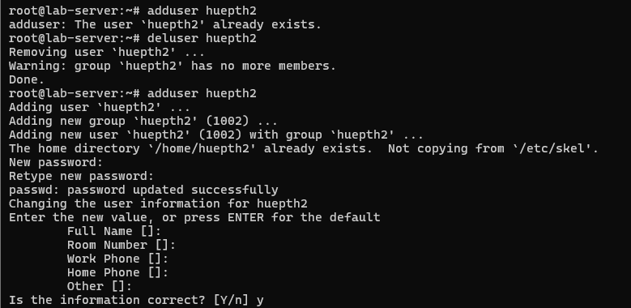
      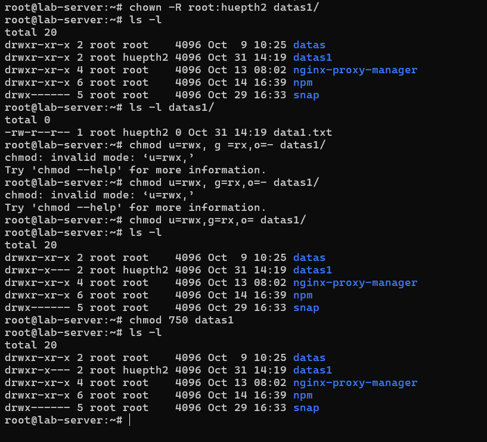

    - Tạo và nén backup thư mục.
    
      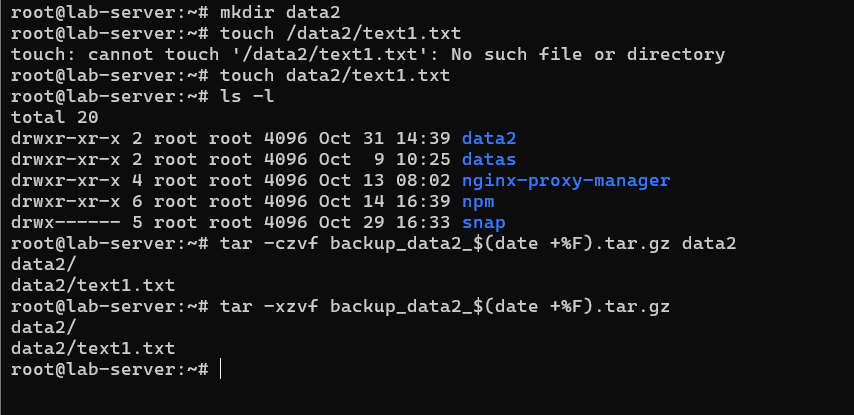

    - Viết script tự động sao lưu log hệ thống hàng ngày.
    
      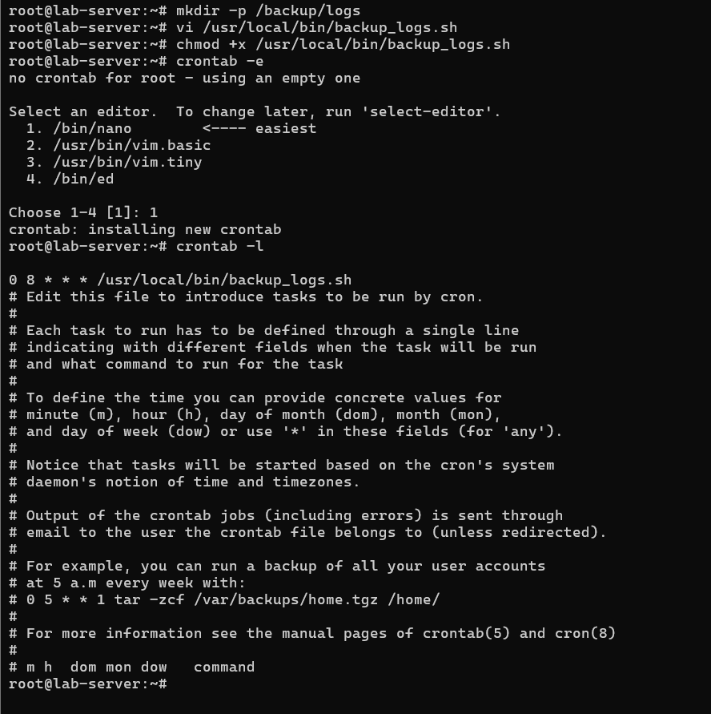
      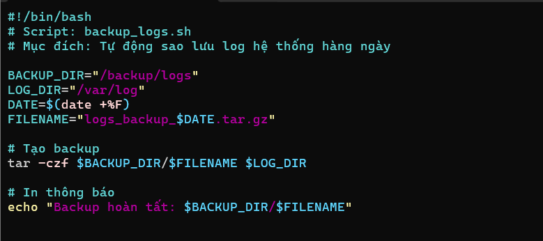

    - Dò tìm file lớn nhất trong thư mục home.
      
      - `du -ah /home | sort -rh | head -n 2` : Hiển thị 2 file hoặc thư mục lớn nhất trong **/home**
      - `find /home -type f -exec du -h {} + | sort -rh | head -n 5` : chỉ liệt kê 5 file lớn nhất không tính thư mục

      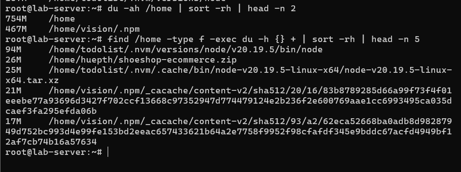

    - Cấu hình SSH và kiểm tra kết nối.
    
      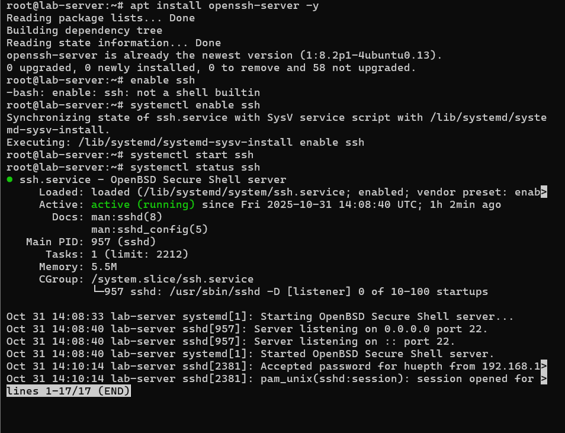
      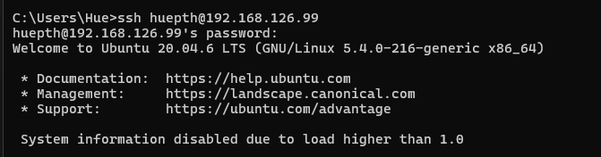

---