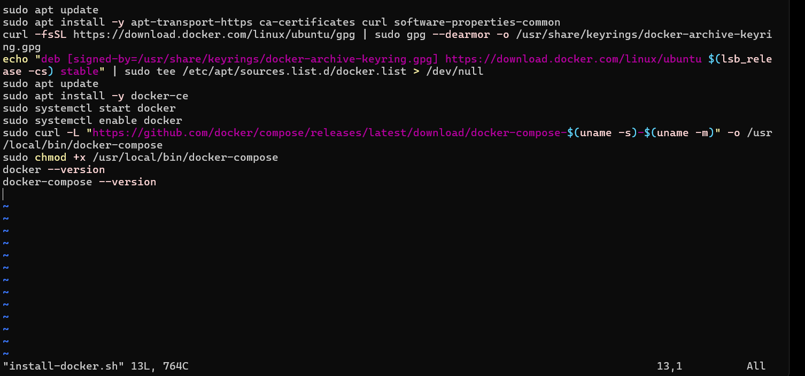
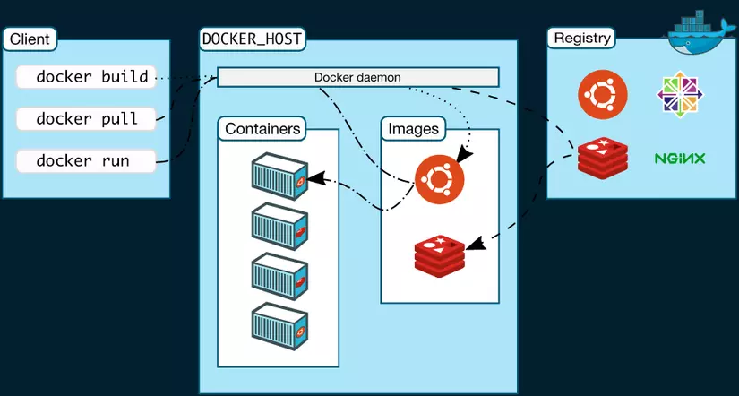
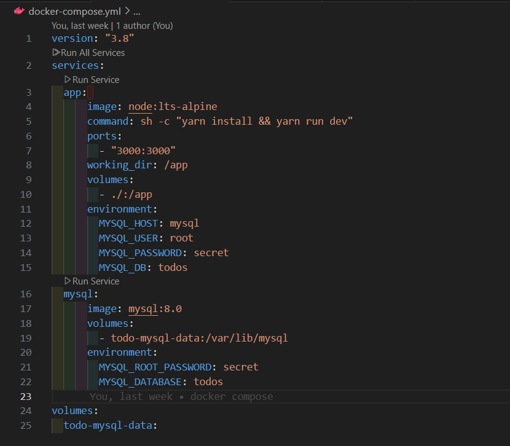
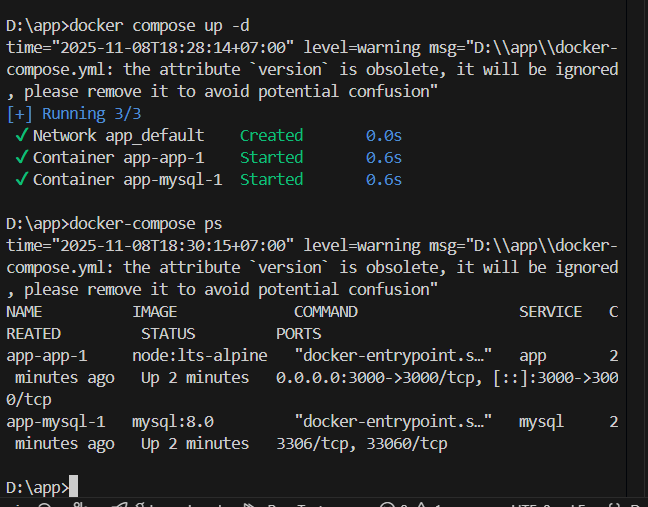

## Phần 1: Tổng quan về ảo hoá

1. **Khái niệm ảo hoá(Virtualization)**
- Khái niệm ảo hoá: quá trình phân chia một máy chủ vật lý thành nhiều máy chủ ảo riêng biệt và độc lập bằng phần mềm. Mỗi máy chủ ảo có thể chạy hệ điều hành riêng một cách độc lập. 
- Mục đích ảo hoá:
  - Khả năng máy chủ cao hơn
  - Chi phí vận hành rẻ hơn
  - Loại bỏ sự phức tạp của máy chủ
  - Tăng hiệu suất ứng dụng
  - Triển khai khối lượng công việc nhanh hơn

2. **Các loại ảo hoá và các công nghệ ảo hóa thông dụng**
- Khái niệm, phân loại ảo hoá:
  - Ảo hóa toàn phần: Sử dụng trình quản lý ảo hóa (Hypervisor) giám sát tài nguyên của máy chủ vật lý và giữ cho mỗi máy chủ ảo độc lập, không bị ảnh hưởng bởi các máy chủ ảo khác. 
  - Ảo hóa bán phần: Các hệ điều hành máy ảo (Guest OS) biết rằng chúng đang chạy trong môi trường ảo, nhờ đó phối hợp với Hypervisor để quản lý tài nguyên hiệu quả hơn.
  - Ảo hóa cấp các hệ điều hành: Không sử dụng Hypervisor mà dùng chính nhân (kernel) của hệ điều hành chủ để tạo các môi trường tách biệt (container).
  
- Liệt kê các công nghệ ảo hóa thông dụng, đang dùng công nghệ nào, áp dụng loại ảo hoá nào.
    |Công nghệ|Loại ảo hóa|
    |----------|-----------|
    |VMWare| Ảo hóa toàn phần|
    |Docker| Ảo hóa cấp hệ điều hành|

3. **Virtual Machine**
- Khái niệm:  máy ảo mô phỏng máy tính vật lý, sử dụng các tài nguyên của máy tính vật lý để khởi chạy chương trình nhưng hoạt động hoàn toàn độc lập với máy tính vật lý đó.
- Trong 1 VM, các thành phần nào có thể ảo hoá? Ảo hóa được hỗ trợ bởi Phần cứng? Ảo hoá bán phần?
  - Các thành phần cứng đều có thể được ảo hóa (CPU, RAM,ổ đĩa cứng...)
    - CPU: ảo hóa bằng cách tạo các lõi ảo, cho phép nhiều VM chia sẻ CPU vật lý.
    - RAM: ảo hóa thông qua bộ nhớ ảo, cấp phát dung lượng cho VM theo yêu cầu.
    - Ổ cứng: ảo hóa bằng file hình ảnh (VD: VMDK, VHD) hoặc phân vùng ảo.
    - Thiết bị mạng: ảo hóa thông qua card mạng ảo (vNIC).
    - Thiết bị ngoại vi khác: như USB, GPU, cũng có thể ảo hóa tùy hỗ trợ phần cứng.
- Vòng đời và quản lý VM: Máy ảo hoạt động dựa trên nguyên tắc ảo hóa (virtualization), nghĩa là tạo ra một môi trường máy tính ảo bên trong máy tính vật lý. Việc quản lý và phân bổ tài nguyên cho VM được thực hiện thông qua hypervisor – phần mềm trung gian giữa phần cứng vật lý và VM.
  - Tạo máy ảo
  - Khởi động máy ảo
  - Hoạt động
  - Tạm dừng hoặc ngừng VM
  - Xóa máy ảo

## Phần 2: Container

1. **Container là gì?**
- Khái niệm: Container là các gói phần mềm nhỏ gọn chứa tất cả các thành phần cần thiết của một ứng dụng như mã nguồn, thư viện, và các công cụ, giúp đảm bảo ứng dụng có thể chạy đồng nhất trên mọi môi trường.
- So sánh Container và VM
- 
| Tiêu chí| Container | Virtual Machine (VM)|
|---------|-----------|----------------------|
| Cấu trúc  | Chạy trên hệ điều hành host, chia sẻ kernel chung | Mỗi VM có hệ điều hành riêng (Guest OS) |
| Hiệu suất| Nhẹ, tốc độ khởi động nhanh  | Tốn tài nguyên hơn, khởi động chậm  |
| Tính bảo mật  | Cách ly kém hơn, phụ thuộc bảo mật của Host OS | Cách ly hoàn toàn giữa các VM, bảo mật tốt hơn  |
| Khả năng mở rộng   | Linh hoạt, triển khai nhanh với Kubernetes  | Mở rộng chậm hơn, yêu cầu nhiều tài nguyên   |
| Triển khai | Phù hợp với DevOps, Microservices  | Phù hợp với ứng dụng truyền thống, hệ thống ổn định |
| Tính tương thích   | Chỉ chạy được trên OS giống với Host | Chạy được trên nhiều hệ điều hành khác nhau (Windows, Linux, macOS) |
| Ứng dụng phổ biến  | Chạy ứng dụng cloud-native, microservices, CI/CD | Chạy hệ thống ERP, tài chính, ngân hàng, phần mềm doanh nghiệp |

2. **Docker** 
    2.1. Tổng quan & Cài đặt Docker
    * Overview về docker container: 
      - Khái niệm: Docker Container là một đơn vị phần mềm độc lập, có khả năng thực thi, chứa đầy đủ mã nguồn, thư viện, công cụ và các thành phần cần thiết để chạy một ứng dụng. Container được xây dựng dựa trên Docker Image và là phiên bản đang chạy của image đó
    * Cài đặt docker (trên linux)
    - Bước 1: Tạo 1 thư mục: `mkdir docker`
    - Bước 2: Tạo 1 file cài đặt `vi install-docker.sh`
    
    

    - Bước 3: Cấp quyền thực thi cho file `.sh`: `chmod +x install-docker.sh`
    - Bước 4: Chạy file `.sh`:
      ```
      Cách 1: ./install-docker.sh
      Cách 2: sh install-docker.sh
      Cách 3: bash install-docker.sh
      ```
    
    * Cấu hình proxy
        * Cho docker daemon: dịch vụ chạy ngầm cần biết proxy để có thể tải image từ Docker Hub hoặc registry khác. 
          - Sử dụng file cấu hình trong thư mục: `/etc/systemd/system/docker.service.d/`
          - Cách làm:
            - Tạo thư mục: `mkdir -p /etc/systemd/system/docker.service.d`
            - Tạo file cấu hình: `vi /etc/systemd/system/docker.service.d/http-proxy.conf`
            - Thêm nội dung, địa chỉ proxy
            ```
            [Service]
            Environment="HTTP_PROXY=http://proxy.yourcompany.com:8080"
            Environment="HTTPS_PROXY=http://proxy.yourcompany.com:8080"
            Environment="NO_PROXY=localhost,127.0.0.1"
            ```
            - Cập nhật lại cấu hình và khởi động Docker:
            ```
            systemctl daemon-reexec
            systemctl daemon-reload
            systemctl restart docker
            ```
            
        * Cho docker client: Docker Client là chương trình dòng lệnh (docker) mà bạn chạy. Nó cũng cần proxy để kết nối ra Internet (ví dụ khi pull image).
          - Tạo và sửa file `~/.docker/config.json:`
          - Thêm phần proxy:
            ```
            {
              "proxies":
              {
                "default":
                {
                  "httpProxy": "http://proxy.yourcompany.com:8080",
                  "httpsProxy": "http://proxy.yourcompany.com:8080",
                  "noProxy": "localhost,127.0.0.1"
                }
              }
            }
            ```
          - Kiểm tra: `docker info` => thấy dòng HTTP Proxy và HTTPS Proxy nếu cấu hình thành công.
    * Cấu hình trusted registry trong daemon.json tham khảo Local Repos
      - Mục đích: 
        - Thiết lập registry nội bộ để lưu giữ image Docker
        - Dùng chứng chỉ SSL tự ký để bảo mật kết nối HTTPS
        - Cho Docker daemon tin tưởng registry và có thể push/pull image mà không báo lỗi SSL.
      - Các bước:
        - Chuẩn bị thư mục và chứng chỉ SSL: => tạo ra `domain.key` && `domain.crt`
        ```
        mkdir -p ~/tools/registry
        cd ~/tools/registry
        apt install openssl

        openssl req -newkey rsa:4096 -nodes -sha256 \
          -keyout domain.key \
          -subj "/CN=192.168.126.100" \
          -addext "subjectAltName = IP:192.168.126.100,DNS:192.168.126.100" \
          -x509 -days 365 -out domain.crt
        ```
        - Tạo `docker-compose.yml` khởi chạy Registry
          ``` version: '3'
          services:
            registry:
              image: registry:2
              restart: always
              container_name: registry-server
              ports:
                - "5000:5000"
              volumes:
                - ./data:/var/lib/registry
                - ./certs:/certs
              environment:
                REGISTRY_HTTP_TLS_CERTIFICATE: ./certs/domain.crt
                REGISTRY_HTTP_TLS_KEY: ./certs/domain.key
            ```
            Chạy lệnh: `docker compose up -d`
        
        - Cấu hình
            ```
            mkdir -p /etc/docker/certs.d/192.168.126.100:5000/
            cp certs/domain.crt /etc/docker/certs.d/192.168.126.100:5000/ca.crt
            systemctl restart docker
            ```

        - Kiểm tra Login:
          `docker login 192.168.126.100:5000`
      
        

    * Hello world với Docker

    2.2. Các câu lệnh cơ bản
    * Docker tag: đặt tên (tag) mới cho 1 image có sẵn — thường để chuẩn bị push lên registry.
      ```
        docker tag <source-image>:<tag> <repository>/<image-name>:<tag>
        VD: docker tag myapp:latest huepth/myapp:v1
      ```
    * Docker run: khởi chạy 1 container mới từ image
      ```
        docker run -dp --name <container-name> <image-name>
        VD: docker run -dp 8080:80 --name webserver nginx
      ```
    * Docker build: dùng để build image từ file **Dockerfile**
      ```docker build -t <image-name>:<tag> <path-to-dockerfile>
      VD: docker build -t myapp:v1 .
      ```
    * Docker push: đẩy image từ máy local lên Docker Registry (Docker Hub hoặc Registry nội nộ)
      ```
      docker push <repository>/<image-name>:<tag>
      VD: docker push huepth/myapp:v1
      ```
    * Docker pull: pull image từ remote repository
      ```docker pull <image-name>:<tag>
      VD: docker pull nginx:latest
      ```
    * Docker images: kiểm tra xem có các images nào trên máy
      ```
      docker images
      ```

    2.3. Dockerfile
    * Viết Dockerfile cho ứng dụng
      - Dockerfile dùng để:
        - Viêt cấu hình đưa source code vào container
        - Cài đặt công cụ để chạy dự án sẵn sàng cho việc khởi chạy.
      - Dockerfile Commands

        | Tên | Khái niệm |Ví dụ|
        |---------------|-------------|----------|
        |`FROM` |xác định base image để bắt đầu. |`FROM node:20` |
        |`WORKDIR`|chỉ định 1 thư mục làm việc bên trong container.|`WORKDIR /app`|
        |`COPY`|copy source code vào trong container.|`COPY ..`|
        |`RUN`|thực thi câu lệnh|`RUN npm install`|
        |`EVN`|khai báo các biến|`ENV PORT 3000`|
        |`EXPOSE`|khai báo PORT mà container chạy |`EXPOSE 80`|
        |`CMD`|xác định lệnh và giá trị mặc định được chạy khi container khởi động|`CMD ["python", "app.py"]`|
        |`ENTRYPOINT`|giữ nguyên 1 lệnh cố định và cho phép lệnh được chỉ định khi chạy container thêm vào cuối của nó|`ENTRYPOINT ["java", "-jar", "app.jar"]`|


    * Build image và chạy container từ Dockerfile
      - Viết dockerfile
      ```
      FROM node:18-alpine
      WORKDIR /app
      COPY . .
      RUN yarn install --production
      CMD ["node", "src/index.js"]
      ```
      - Build image từ Dockerfile `docker build -t <image-name>:<tag> <đường-dẫn-đến-Dockerfile>`
      
      - Chạy container từ image
      `docker run -dp 3000:3000 --name myapp_container myapp:1.0`

      
      
    2.4. Kiến trúc Docker

      

    * Docker CE/Docker EE
      - Docker CE (Community Edition): Phiên bản miễn phí, phổ biến cho cá nhân, sinh viên và nhà phát triển.
      - Docker EE (Enterprise Edition): Phiên bản thương mại, dành cho doanh nghiệp với các tính năng bảo mật, quản lý người dùng và hỗ trợ kỹ thuật chuyên nghiệp
    * Docker Engine: là thành phần lõi của Docker, bao gồm daemon (dockerd) và client (docker CLI), chịu trách nhiệm khởi tạo và quản lý container.
    * Docker Compose:thực hiện chạy ứng dụng thông qua việc định nghĩa cấu hình các Docker Container, thường thông qua file cấu hình.
    * Docker Registry: là nơi lưu trữ và phân phối Docker image – giống như “kho hàng” cho container.
      - Docker Hub: Registry công khai mặc định.
      - Private Registry: Registry tự host, kiểm soát truy cập.
    * Docker Daemon: (dockered) lắng nghe các yêu cầu của người dùng thông qua các Docker API và quản lý các đối tượng Docker như image, container, network và volume. Một daemon cũng có thể giao tiếp với các daemon khác để quản lý các Docker service.
    * Docker network: Host, Bridge, Overlay, ...
      - Docker network quản lý, cung cấp các tùy chọn kết nối giữa các container, với Docker host và với các tiến trình bên ngoài thông qua các driver như bridge, host, overlay, macvlan.
        - Bridge: Mặc định, kết nối các container trên cùng host.
        - Host: Container sử dụng trực tiếp network của host.
        - Overlay: Kết nối các container trên nhiều host khác nhau.
        - Macvlan: Gán địa chỉ MAC riêng cho container để tham gia trực tiếp vào mạng vật lý.
    * Docker volume, mount
      - Volume được thiết kể để làm nơi lưu trữ các dữ liệu độc lập với vòng đời của container. Dữ liệu trong volume tồn tại ngay cả khi container bị xóa.
      - Mount có thể gắn volume vào container để chia sẻ dữ liệu.

    2.5. Docker-compose
    * Định nghĩa: công cụ giúp định nghĩa và chạy nhiều container cùng lúc thông qua file docker-compose.yml với service definitions, dependencies, và shared resources.
    * Thực hành chạy file-config
      - Tạo file `docker-compose.yml`
      
      

      ```
        services: định nghĩa các container cần chạy (ví dụ: web, db)
        build: đường dẫn đến Dockerfile nếu muốn build trực tiếp
        ports: ánh xạ cổng từ host -> container
        volumes: giữ dữ liệu hoặc mount code
        networks: cho phép các container giao tiếp nội bộ
        depends_on: đảm bảo thứ tự khởi động container
        environment: khai báo biến môi trường cho containe
      ```

      - Chạy `docker-compose up -d`
      - Xem các container đang chạy `docker-compose ps`
      

            


