# Triển khai bằng Linux
1. Clone dự án và tạo user và cấp các quyền cho project
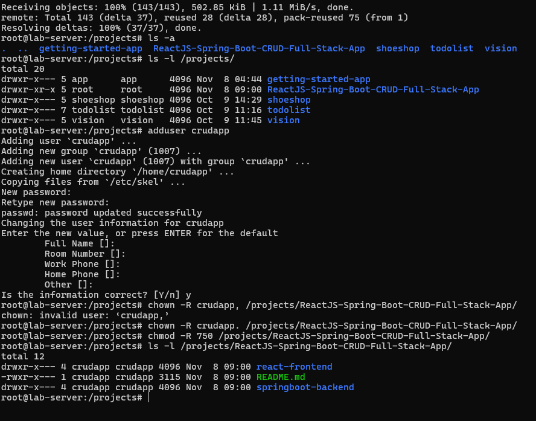 

2. Cài đặt môi trường, thư viện chạy

 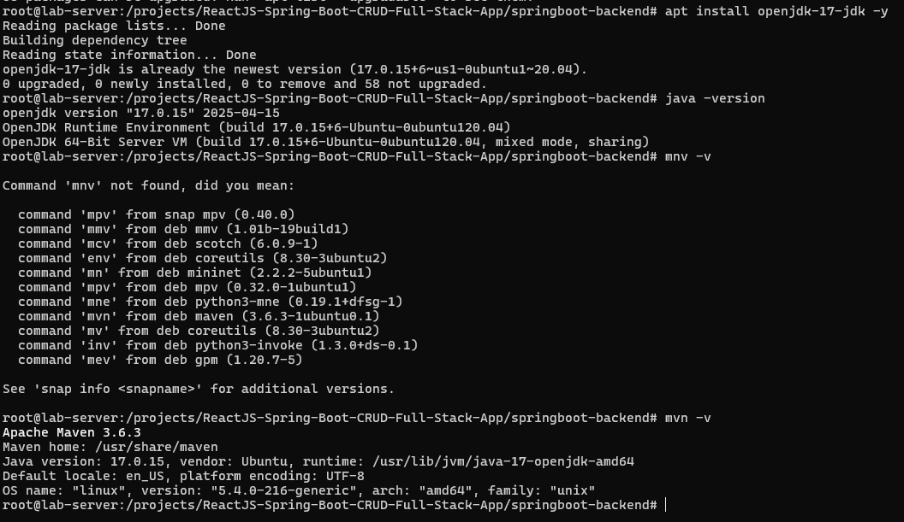 

3. Thiết lập Database
    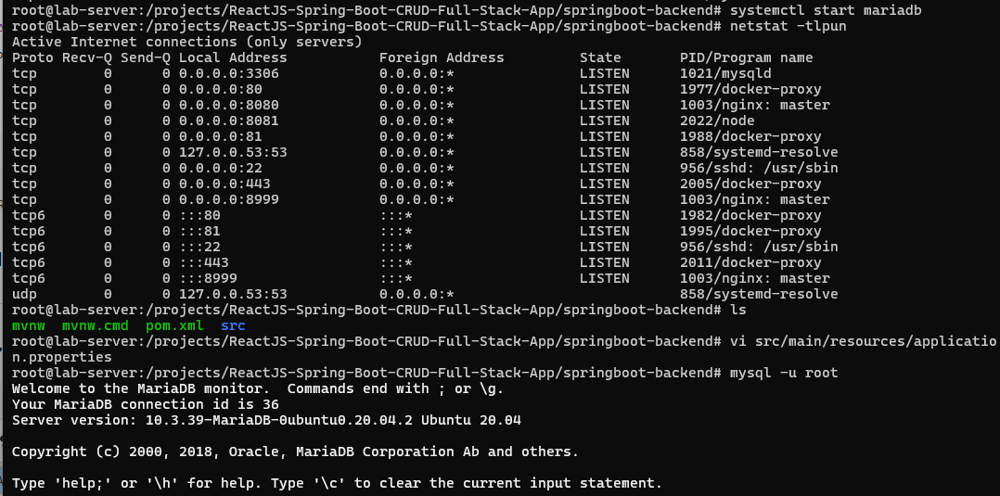 

    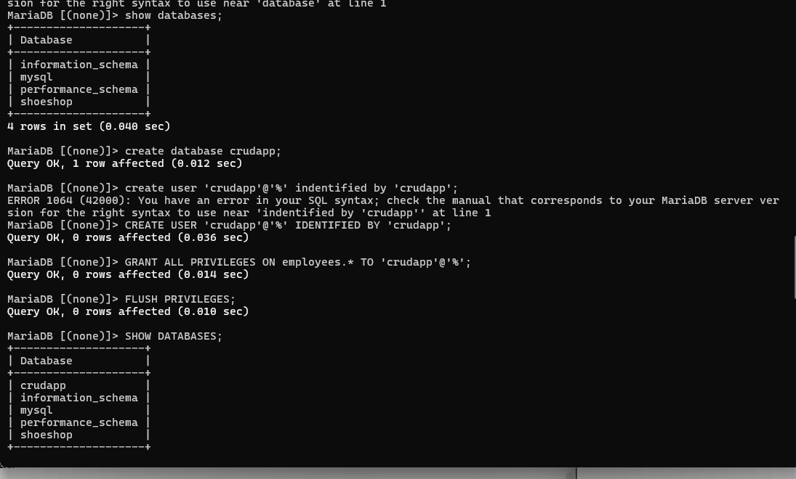 

     

     

4. Khởi chạy java Spring bôt
    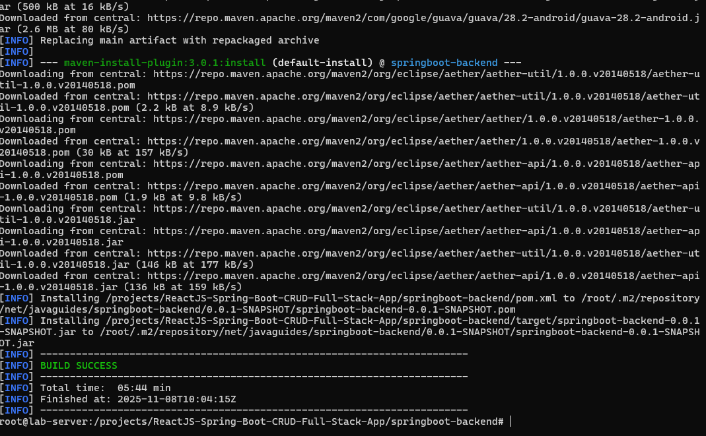 

    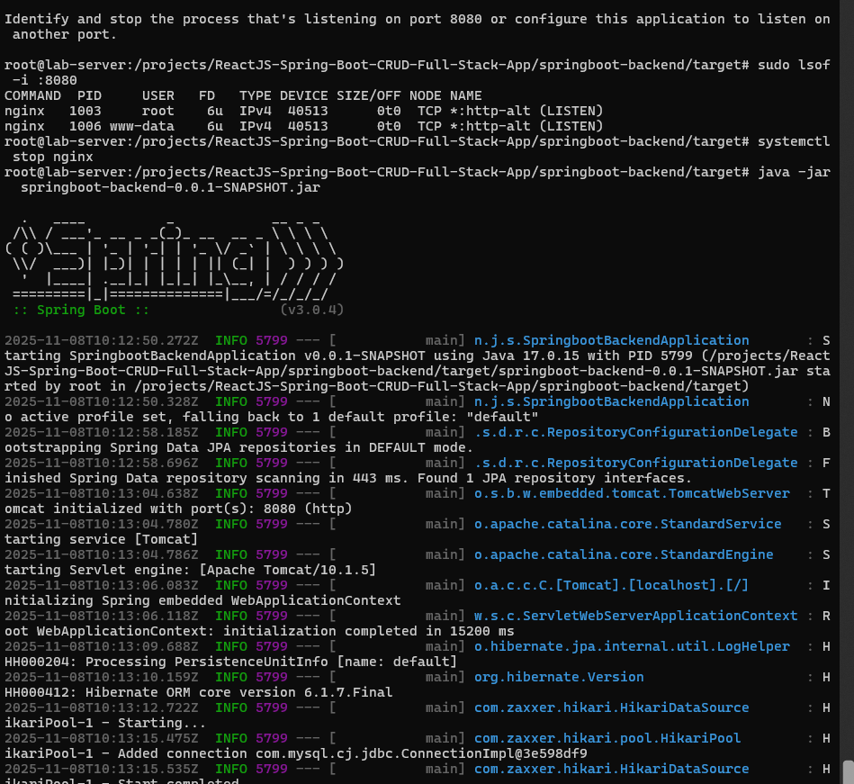 

5. Triển khai Front end
   - Sửa file cấu hình phía service `http` khi gọi tới port BackendEnd
   
    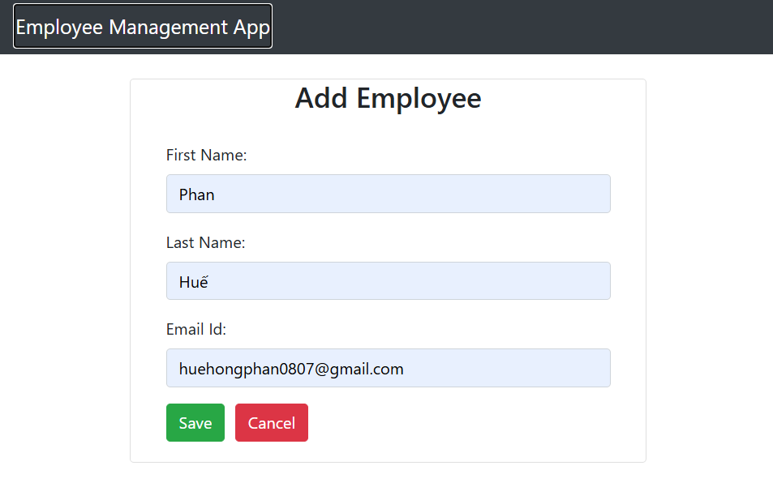 


# Triển khai Docker
Bước 1: Viết dockerfile cho frontend và chạy lệnh `build` để kiểm tra.

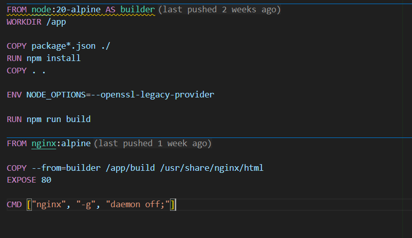 
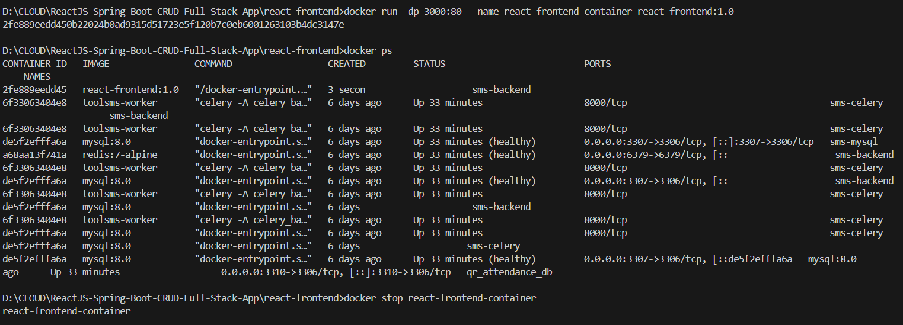 

Bước 2: Viết dockerfile cho backend và chạy lệnh `build` để kiểm tra.

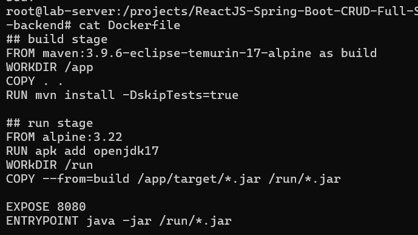


### Bài LAB Nexus 
Bước 1: 
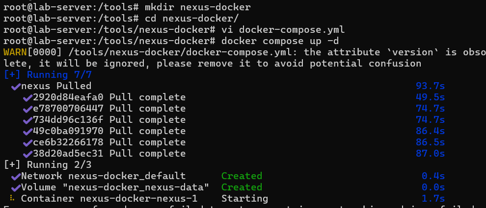 

File cấu hình:
```
  version: '3'
  services:
    nexus:
      image: sonatype/nexus3:latest
      ports:
        - "8081:8081"
        - "5000:5000"
      volumes:
        - nexus-data:/nexus-data
      environment:
        - NEXUS_SECURITY_RANDOMPASSWORD=false
        - NEXUS_CONTEXT=/  # Context path
      restart: always
  volumes:
    nexus-data:
```

Chạy lệnh `  docker-compose up -d`

Truy cập `192.168.126.99:8081`
Đăng nhập: admin
Pass: admin123

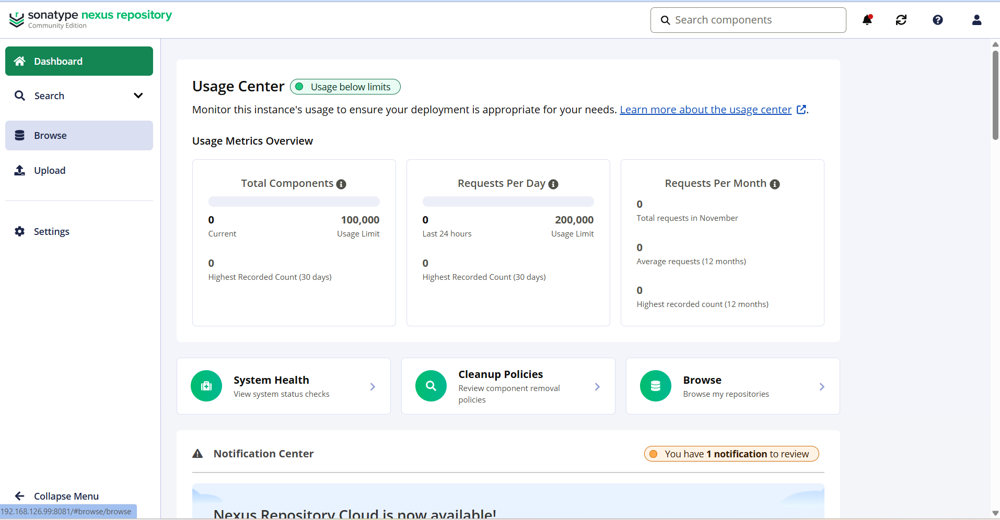 


