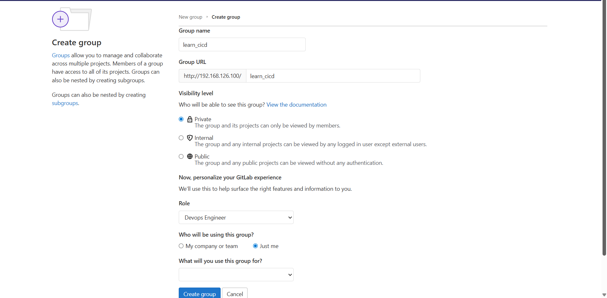
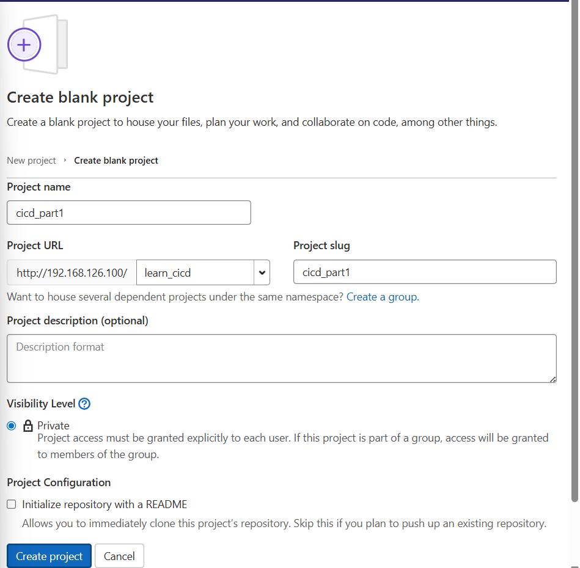
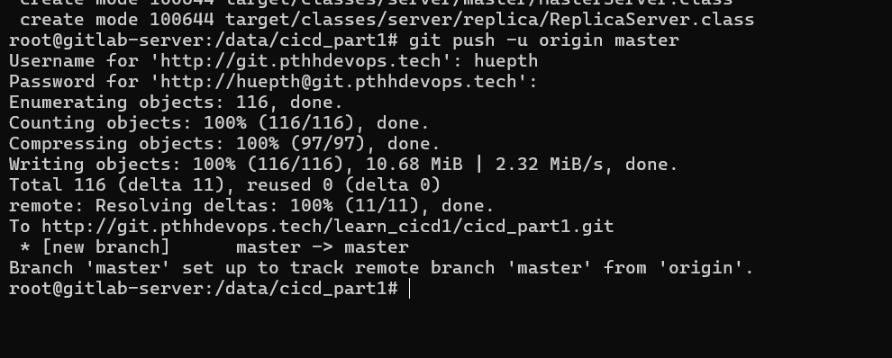
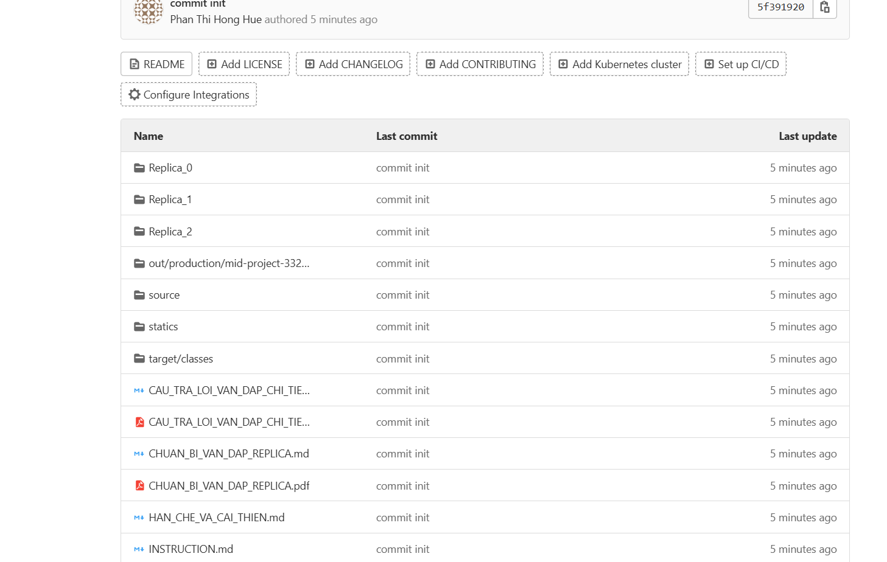
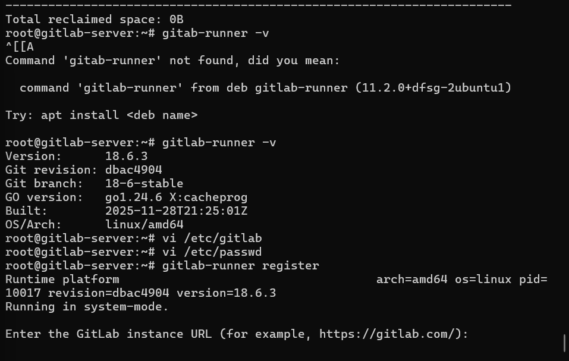
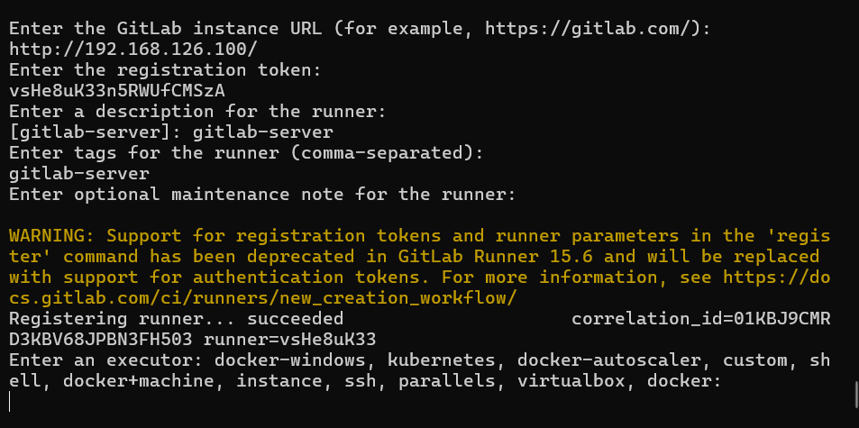
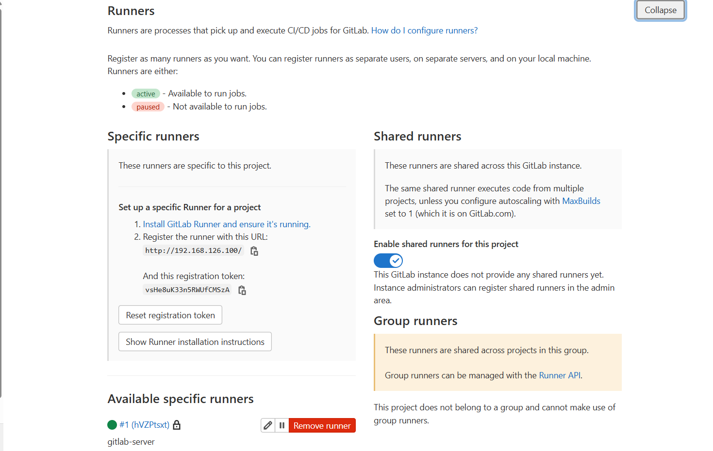

# week4: CI/CD Với gitlab

## 1.

- Tạo GitLab repository và đẩy source code lên.







 

- Viết file `.gitlab-ci.yml`.

- Định nghĩa các stage cơ bản:
  - `build`
  - `test`
- Chạy pipeline tự động khi push code (Luông ci/cd chạy khi push code lên theo tag).
- Xuất artifact sau build (nếu có).

## 2.

- Cài và đăng ký GitLab Runner tự quản lý.






Khởi chạy gitlab-runner

``` 
nohup gitlab-runner run --working-directory /home/gitlab-runner/ --config /etc/gitlab-runner/config.toml --service gitlab-runner --user gitlab-runner 2>&1 & 
```



- Thực hiện tự động build Docker image.
- Push image lên GitLab Container Registry.
- Sử dụng variable để quản lý thông tin:
  - Docker registry
  - Username/password
  - Application config
- Thiết lập deploy tự động lên môi trường STAGING.
- Triển khai deploy qua:
  - SSH script
  - Docker compose

## 3.

- Thiết lập deploy thủ công (manual) lên PRODUCTION.
- Sử dụng branch rule:
  - `develop` → deploy STAGING
  - `main` → deploy PRODUCTION
- Thêm job scan bảo mật:
  - Dependency scan
  - Container image scan
- Thêm code quality hoặc coverage report.
- Thêm thông báo pipeline:
  - Slack
  - Email
  - Teams
- Triển khai Blue/Green hoặc Canary (nếu có).
- Thiết lập auto rollback nếu deploy thất bại.

Note: Tất cả luồng ci/cd cần được thực hiện xây dựng mô phỏng hệ thống thật, đảm bảo bảo mật và tính HA.